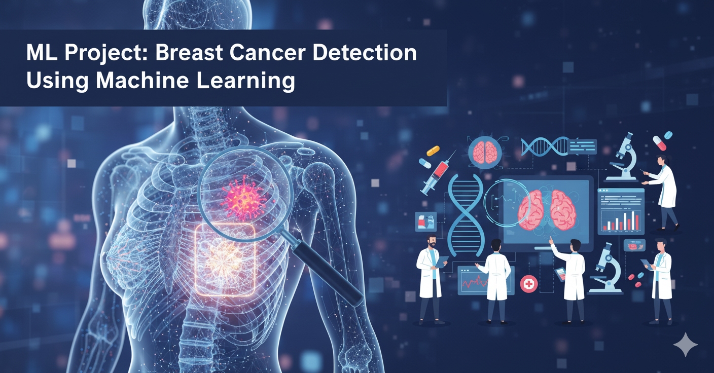

# 🔬 Breast Cancer Detection Mini Project
## Utilizing Machine Learning

---

# What is Breast Cancer?

Breast cancer is a disease in which cells in the breast grow out of control. It typically starts in the inner lining of milk ducts or the lobules that supply the ducts with milk. These cancer cells can form a mass or tumor and, if left unchecked, can metastasize (spread) to other parts of the body.

---
**Prevalence (Global Statistics)**

- **Global Burden (2022):** Breast cancer is the **most commonly diagnosed cancer worldwide**, with an estimated **2.3 million** new cases diagnosed globally in women.
- **Mortality Rate (Example/US based):** About **41,760** women will die from breast cancer (based on recent US estimates). This stark figure underscores the critical need for advanced and accurate early detection tools.

To illustrate the global variation, here are the estimated **Age-Standardized Incidence Rates (ASR)** per 100,000 women in selected countries (2022 Data):

| Country | ASR (per 100,000) |
| :---: | :---: |
| **France (Metropolitan)** | **105.4** |
| **United States** | **95.9** |
| **Germany** | **78.0** |
| **Brazil** | **52.2** |
| **Iran (Estimate)** | **47.7** |
| **China** | **33.0** |
| **India** | **26.6** |

**Reference:** These figures are sourced from the **Global Cancer Observatory (GLOBOCAN 2022)**, developed by the International Agency for Research on Cancer (IARC), which is a part of the World Health Organization (WHO).

# Role Of Machine Learning In Detection Of Breast Cancer

Machine Learning plays a crucial role by enabling systems to analyze complex patterns within medical data (such as biopsy results, mammograms, and patient records). Classification models are trained to accurately distinguish between **Benign** (non-cancerous) and **Malignant** (cancerous) tumors, thereby assisting medical professionals in early diagnosis and significantly improving screening accuracy.

---

# RESULTS

**Current Project Status:**

The initial data preprocessing steps have been successfully completed:
* Data Loading (using the built-in `sklearn.datasets.load_breast_cancer`).
* Initial Data Exploration.
* Train-Test Split of the dataset.
* Feature Normalization (Scaling) for optimal model performance.

**Next Steps:**

The next phase will involve applying various classification algorithms (e.g., Logistic Regression, SVM, Decision Trees) and tuning their hyperparameters.

***The final model performance metrics (Accuracy, F1-Score, etc.) will be updated here soon!***

---

# Final Note

I am genuinely excited about this project! My intense interest in **Artificial Intelligence** motivated me to start learning Machine Learning. After grasping the foundational steps and completing several smaller practice projects, I have now embarked on one of the most rewarding, practical, and much-needed applications in the fields of medicine and AI.

Through this project, besides learning core Machine Learning concepts, I have gained profound and valuable insights into breast cancer, particularly the painful reality of its mortality rates. This knowledge has further fueled my strong motivation to develop better and more accurate detection projects in the future, ultimately aiming to help improve early diagnosis.

I am following this project by utilizing **educational resources available on the internet** and drawing inspiration from the structure and methodologies of previously completed projects in the ML community.